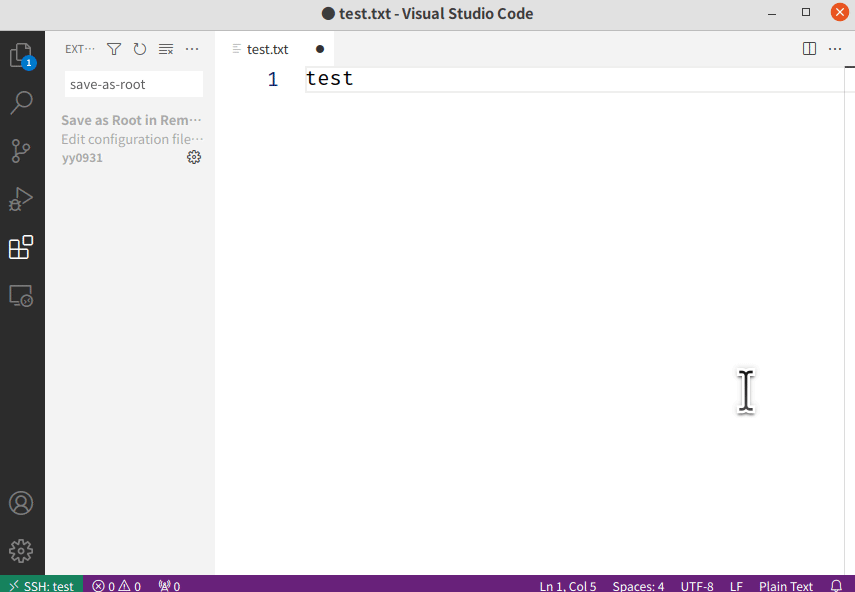

# Save as Root in Remote - SSH
This extension saves files with root privileges on Linux or macOS environments connected with `Remote - SSH`,
is an easy solution to [FileSystemProvider: no way of handling permissions issues #48659](https://github.com/microsoft/vscode/issues/48659).

## Usage
This extension overrides ctrl+S (or cmd+S) to use the sudo command when the current user does not have write permission.



## If you are using ctrl+S for actions other than saving files
(e.g. emacs extensions use ctrl+s for in-file searches), add the following code to [keybindings.json](https://code.visualstudio.com/docs/getstarted/keybindings#_advanced-customization) to disable the keybinding of this extension and use `Save as Root` in the command palette (F1 or Ctrl+Shift+P or Cmd+Shift+P) instead.

```json
{
    "key": "ctrl+s",  // Replace this with "cmd+s" if you are using Mac.
    "command": "-save-as-root.saveFile",
    "when": "save-as-root.noWriteAccess"
}
```


## Contributing
If you find a bug or have a suggestion, feel free to submit an issue/PR to my repository.
